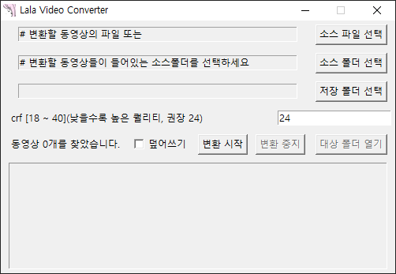
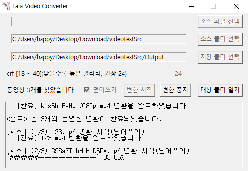

# Lala Video Converter

## Lighten Your Precious Folders!

> ### **※ FFmpeg must be installed beforehand.**

Batch adjust the quality (crf) of videos in folder or file units.

The names of the converted files will include information about the changed crf, like `videoFile_crf24.mp4`

Download executable file: [./dist/Lala%20Video%20Converter.exe](./dist/Lala%20Video%20Converter.exe)

**I'm currently facing an issue where Python-built executables are being recognized as viruses by Windows Defender.**

**I'm working on resolving this problem, but until it's fixed, the executable files get deleted unless I add them as exceptions in Defender.**

## 부제 : 당신의 방주를 가볍게!

> ### **※ FFmpeg의 설치가 우선적으로 되어있어야 합니다.**

폴더단위 또는 파일단위로 동영상의 품질(crf)을 일괄 조절합니다.

변환된 파일의 이름은 `videoFile_crf24.mp4` 와 같이 바뀐 crf에 대한 정보를 포함합니다.

실행파일 다운로드 : [./dist/Lala%20Video%20Converter.exe](./dist/Lala%20Video%20Converter.exe)

**Python 빌드 문제로 Window Defender에서 바이러스로 인식하는 문제가 있습니다.**

**해결 해 보고는 있는데, 해결 전까지는 Defender 예외처리를 하지 않으면 실행파일이 삭제됩니다...**

### Todo Memo
체크박스로 만들면 좋을만한 것들
- 같은이름 출력
- 같은이름 출력 후 원본 대체하기
- 원본삭제
- 크기 비교 후 작은 것 남기기
- 로그파일 남기기
